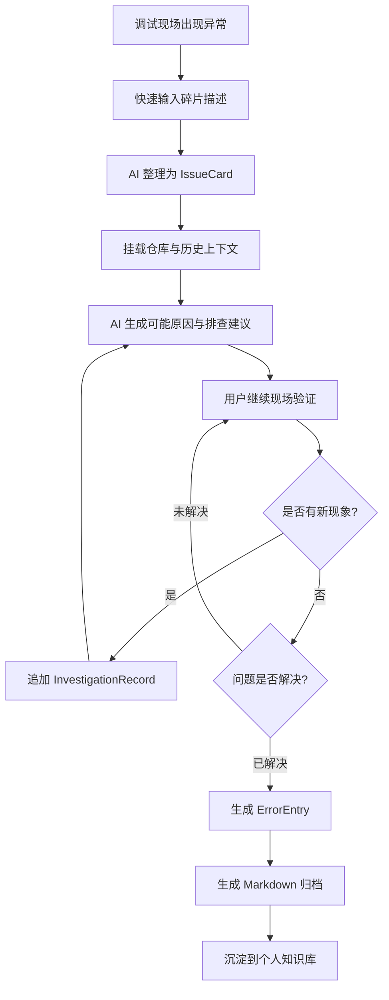
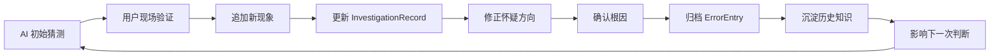
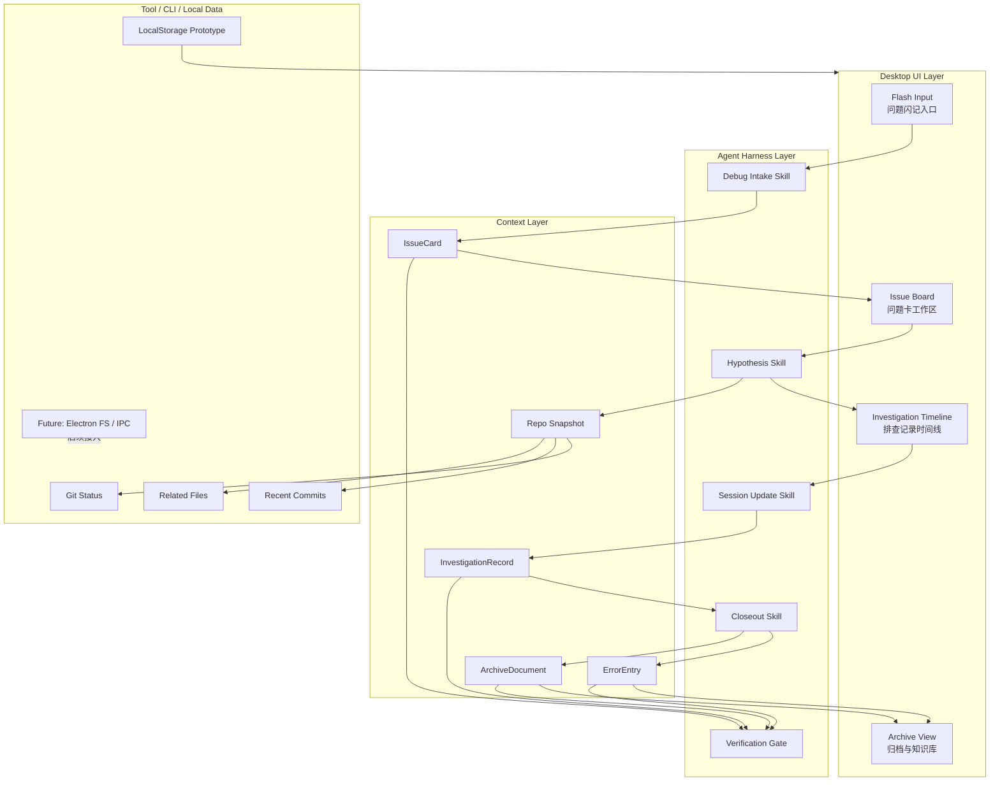

<div align="center">

# ⚡ ProbeFlash

### 面向嵌入式调试现场的问题闪记与知识归档系统

**把“串口又乱了 / CAN 又抽风了 / 自动跑点方向不对”这种现场碎片，<br />
整理成可追踪、可复盘、可归档的调试知识资产。**

<br />


<br />

[Demo GIF 占位] · [产品截图占位] · [比赛演示视频占位]

</div>

---

## 一句话介绍

**ProbeFlash** 是一个面向嵌入式、硬件、机器人和自动化调试现场的 AI 原生调试工作台。

它围绕真实调试流程组织信息：

> 问题闪记 → AI 结构化 → AI 猜测方向 → 过程追记 → 结案归档 → 个人知识库积累

当前版本是 48 小时交付导向的产品原型：主流程已在浏览器 SPA + `window.localStorage` 中跑通；Electron / fs / IPC / `.debug_workspace` 文件写盘仍作为后续工程化方向，不伪装为已完成能力。

---

## 痛点来源：真实调试现场的问题

这个项目来自我在日常学习、开发和嵌入式调试中的真实痛点。

硬件调试现场的问题通常不是完整、安静、可以慢慢整理的。更多时候，它们会突然出现：

- “串口又乱码了，但刚才好像还正常。”
- “CAN 总线偶发丢帧，复现条件不稳定。”
- “自动跑点方向不对，像是坐标系反了。”
- “换了一个参数后电机抖了一下，但日志没来得及截。”
- “这个问题以前好像遇到过，但我找不到当时怎么解决的。”

调试人员当下往往在救火：看波形、接串口、改参数、重启设备、对比代码、和队友同步现象。结果是：

| 现场问题 | 直接后果 |
|---|---|
| 问题记录很碎 | 事后无法复盘 |
| 排查过程丢失 | 不知道当时为什么这么判断 |
| 历史经验分散 | 同类 bug 反复踩坑 |
| 描述口语化 | 难以沉淀成团队知识 |
| 解决后不归档 | 经验不能复用 |

**ProbeFlash 想解决的，就是“调试知识从现场碎片到可复用资产”的最后一公里。**

---

## 我做了什么

ProbeFlash 以“调试现场的最短输入路径”为核心，做了一套面向问题闭环的工作流：

| 能力 | 说明 | 当前状态 |
|---|---|---|
| ⚡ 闪电启动 | 快速打开输入入口，适合现场随手记录 | 产品原型已预留入口形态 |
| 🧩 问题闪记 | 输入口语化、残缺的问题描述 | 已有 IssueCard 创建表单 |
| 🧠 AI 补全与表达优化 | 将碎片描述整理为结构化问题卡 | Harness / Skill 规则已固化，模型接入可扩展 |
| 🔍 AI 猜 bug | 基于问题、仓库上下文、历史记录给出怀疑方向 | 设计已落在 `debug-hypothesis` Skill |
| 📝 追加记录 | 排查过程中持续补充新现象、新判断、新结论 | 已支持 InvestigationRecord 追记 |
| 📦 归档整理 | 结案后生成错误表与 Markdown 归档 | 已支持 ArchiveDocument + ErrorEntry 生成 |
| 🗂 知识库积累 | 让调试记录从临时救火变成可复用资产 | 当前为本地原型，后续接入真实文件写盘与检索 |

---

## 核心功能

| 模块 | 功能 | 价值 |
|---|---|---|
| Flash Intake | 快速输入现场问题 | 降低记录成本 |
| IssueCard | 结构化问题卡 | 让问题可追踪 |
| Investigation Timeline | 排查记录时间线 | 保留判断变化 |
| Hypothesis Agent | 生成可能原因和验证动作 | 辅助定位 bug |
| Closeout Archive | 结案生成错误表与归档文档 | 形成经验资产 |
| Repo-aware Context | 挂载仓库、分支、提交、相关文件 | 让 AI 不脱离工程上下文 |
| Verification Gate | schema 校验、读回验证、完成门 | 避免“看似完成”的伪闭环 |

---

## 典型使用流程



---

## Harness / Agent 设计

比赛要求中的 Harness / Agent 能力，是 ProbeFlash 的重点。

ProbeFlash 不是“把用户输入丢给大模型聊天”，而是把 AI 放进一个受约束、有上下文、有验证、有反馈的调试闭环中。

### 1. 上下文管理 / Agent Skill

ProbeFlash 将调试任务拆成多个明确阶段，每个阶段都有固定输入、输出和约束。

| 阶段 | 输入 | 输出 | 约束 |
|---|---|---|---|
| Debug Intake | 用户碎片描述 | IssueCard | 必须结构化，不直接下最终结论 |
| Debug Hypothesis | IssueCard + 仓库上下文 | 怀疑方向列表 | 每条猜测必须包含依据和验证动作 |
| Session Update | 新现象 / 新日志 / 新判断 | InvestigationRecord | 必须保留时间线 |
| Debug Closeout | 根因与解决方式 | ErrorEntry + ArchiveDocument | 必须能读回、能复用 |
| Task Verification | 产物 + 工具结果 | completion gate 判断 | 最小验证、交接更新、commit 缺一不可 |

仓库中对应的规则入口：

```text
.agents/skills/
  debug-intake/
  debug-hypothesis/
  debug-session-update/
  debug-closeout/
  repo-onboard/
  task-verification/
```

这些 Skill 文件让 AI 的行为有明确边界：输入是什么、输出什么结构、哪些字段不能缺、什么时候允许结案、什么时候必须继续追记。

### 2. Tool / CLI / Repo-aware 能力

嵌入式问题通常离不开代码仓库和历史改动。ProbeFlash 的设计目标是让 Agent 能结合本地工程上下文，而不是只依赖用户口述。

可挂载的上下文包括：

- 当前仓库路径、分支和 HEAD commit
- 最近 commit 与工作区改动
- 相关源码文件
- 历史 IssueCard / InvestigationRecord
- 历史 ErrorEntry / ArchiveDocument
- 用户追加的新现象和验证结论

本地工具示例：

```bash
git status --short
git log --oneline -5
git diff --stat
```

这些信息可以帮助 Agent 判断：最近是否改过串口、CAN、运动控制或传感器相关代码；异常更像配置问题、时序问题、初始化顺序问题，还是历史上出现过的同类问题。

### 3. Feedback Loop：验证与反馈循环

调试不是一次问答，而是持续修正判断的过程。



例如：AI 初始怀疑是波特率问题；用户追加记录发现换线后仍复现；系统记录这个验证结果；后续判断就会降低“线材问题”的优先级，转向初始化顺序、DMA 配置或总线负载。

---

## 系统架构



---

## 为什么它比普通记录工具更强

普通记录工具解决的是“写下来”。ProbeFlash 解决的是：

> 写得快、写得准、能追踪、能结案、能复用。

| 对比项 | 普通笔记 | ProbeFlash |
|---|---|---|
| 输入方式 | 手动整理 | 碎片输入即可 |
| 问题结构 | 靠用户自觉 | IssueCard 结构化约束 |
| 排查过程 | 容易散落 | InvestigationRecord 持续追记 |
| 历史复用 | 靠全文搜索 | 错误表 + 归档文档 |
| AI 能力 | 可选辅助 | 嵌入调试闭环 |
| 工程上下文 | 通常没有 | 可挂载仓库和 Git 信息 |
| 结案能力 | 手动总结 | 自动形成经验资产 |

---

## 为什么它不是普通聊天机器人

### AI 被流程约束

AI 不能随便回答，而是必须在指定阶段输出指定结构：

- Intake 阶段输出 IssueCard
- Hypothesis 阶段输出“可能原因 + 依据 + 验证动作”
- Session Update 阶段输出 InvestigationRecord
- Closeout 阶段输出 ErrorEntry 和 ArchiveDocument

### AI 能读取工程上下文

ProbeFlash 的设计目标是让 AI 结合仓库状态、最近代码改动、历史记录和用户追记，而不是只根据当前一句话猜测。

### AI 的判断会被反馈修正

ProbeFlash 的循环是：

```text
猜测 → 验证 → 追加记录 → 修正判断 → 结案 → 进入知识库
```

最终归档会反过来影响下一次类似问题的判断。

---

## 比赛要求对应说明

| 比赛关注点 | ProbeFlash 的回应 |
|---|---|
| 痛点发现 | 来自真实嵌入式调试现场：问题碎片化、排查过程易丢失、经验难复用 |
| AI 原生 | AI 参与 IssueCard、Hypothesis、Record、Archive 全流程，而不是只润色文本 |
| Harness 设计 | 通过 Agent Skill、结构化模板、阶段约束、schema 校验和完成门管理 AI 行为 |
| Tool / CLI 能力 | 设计支持读取 Git 状态、最近提交、相关文件、本地历史记录等上下文 |
| Feedback Loop | 通过追加记录、用户确认、结案归档反向修正 AI 判断 |
| 48 小时交付 | 聚焦完整产品闭环：输入、整理、猜测、追记、归档、展示 |
| Demo 友好 | 可以用一个现场问题讲完整闭环，不依赖复杂配置 |
| 真实可信 | 当前明确标注 SPA + localStorage 边界，Electron / fs / IPC 为后续方向 |

---

## 技术栈

| 层级 | 技术 |
|---|---|
| 前端 | React / TypeScript / Vite |
| 桌面方向 | Electron |
| 原型存储 | `window.localStorage` |
| 结构校验 | zod schema |
| Agent Harness | Skill / Prompt Template / Structured Output |
| 工程上下文 | Git / Repo Snapshot / Local CLI |
| 归档形态 | ErrorEntry / ArchiveDocument / Markdown |
| 后续扩展 | Electron IPC / 文件系统写盘 / 本地知识库检索 |

---

## 快速开始

```bash
git clone [你的仓库地址占位]
cd ProbeFlash
```

当前可运行的产品壳位于 `apps/desktop`：

```bash
cd apps/desktop
npm install
npm run dev
```

默认本地访问地址：

```text
http://localhost:5173
```

可选验证命令：

```bash
npm run typecheck
npm run build
```

---

## Demo 展示建议

建议用一个嵌入式现场问题来演示完整闭环。

示例输入：

```text
今天调车的时候 CAN 又抽风了，电机偶发不响应。
重启以后短时间正常，跑一会又出现。
最近好像改过心跳和自动跑点逻辑。
```

演示路径：

1. 在问题闪记入口输入这段碎片描述。
2. 生成结构化 IssueCard。
3. 给出可能方向：CAN 心跳超时、状态机异常、自动跑点时序问题、总线负载问题。
4. 追加新现象：更换电源仍复现、降低发送频率后明显好转。
5. 修正判断方向。
6. 结案生成 ErrorEntry 与 ArchiveDocument。

[首页截图占位]

[IssueCard 截图占位]

[归档结果截图占位]

---

## 项目亮点

### 1. 面向调试现场，而不是泛泛记录

ProbeFlash 允许用户先写碎片，再通过结构化流程整理成问题卡。

### 2. AI 被放进调试闭环

AI 不只负责润色文字，而是参与问题识别、怀疑方向、过程追踪和结案归档。

### 3. Harness 设计清晰

Skill、模板、schema 校验和完成门让 AI 行为可控、可追踪、可复用。

### 4. 适合个人知识库积累

每个解决过的问题都可以沉淀成下一次排查时的参考资产。

### 5. 48 小时内形成完整产品原型

项目优先完成可展示闭环，而不是停留在单点功能或纯概念说明。

---

## 核心创新

| 创新点 | 说明 |
|---|---|
| 问题闪记 | 适合调试现场的低成本输入 |
| 结构化 IssueCard | 将口语化描述转成可追踪问题 |
| Repo-aware AI | 让 AI 结合工程上下文判断 |
| Investigation Timeline | 保留排查过程中的判断变化 |
| Closeout Archive | 把解决结果变成知识资产 |
| Feedback Loop | 让最终归档反向增强后续判断 |

---

## 当前限制

必须如实说明的边界：

- 当前重点是浏览器 SPA / 桌面应用原型展示。
- 本地数据主要依赖 `window.localStorage`。
- Electron 文件系统写盘能力尚未接入。
- Git / CLI / Repo-aware 能力已有 Harness 设计，完整产品化仍需后续接入。
- 历史问题检索目前以结构化归档设计为主，完整向量检索属于后续方向。
- AI 输出需要用户确认，不能替代真实硬件验证。

---

## 后续迭代方向

### 必须改

- 接入 Electron IPC 与本地文件系统写盘。
- 将 IssueCard / InvestigationRecord / ErrorEntry / ArchiveDocument 持久化到 `.debug_workspace`。
- 增加归档读回验证，避免“看似归档但文件未落盘”。
- 完善 Git 仓库快照读取能力。

### 建议改

- 增加历史问题相似度检索。
- 增加调试记录搜索和标签系统。
- 支持按模块分类，例如串口、CAN、电机、传感器、自动控制。
- 增加 Demo 数据一键导入。

### 可选优化

- 支持团队共享知识库。
- 支持导出 PDF / HTML 报告。
- 接入 MCP 工具链。
- 增加日志、截图、波形片段附件管理。
- 增加多项目工作区。

---

## 项目定位总结

ProbeFlash 不是一个万能 AI 助手。

它更像是一个为嵌入式调试现场定制的 AI 调试记录员：

- 当问题突然出现时，它帮你快速记下来。
- 当描述很乱时，它帮你整理清楚。
- 当你不知道从哪里查时，它给出怀疑方向。
- 当排查过程变长时，它帮你保留时间线。
- 当问题解决后，它帮你沉淀成知识资产。

> 让每一次调试现场的临时救火，都成为下一次更快解决问题的经验积累。

---

<div align="center">

**ProbeFlash — 面向嵌入式调试现场的问题闪记与知识归档系统**

AI Native Debugging · Agent Harness · 48h Prototype

</div>
